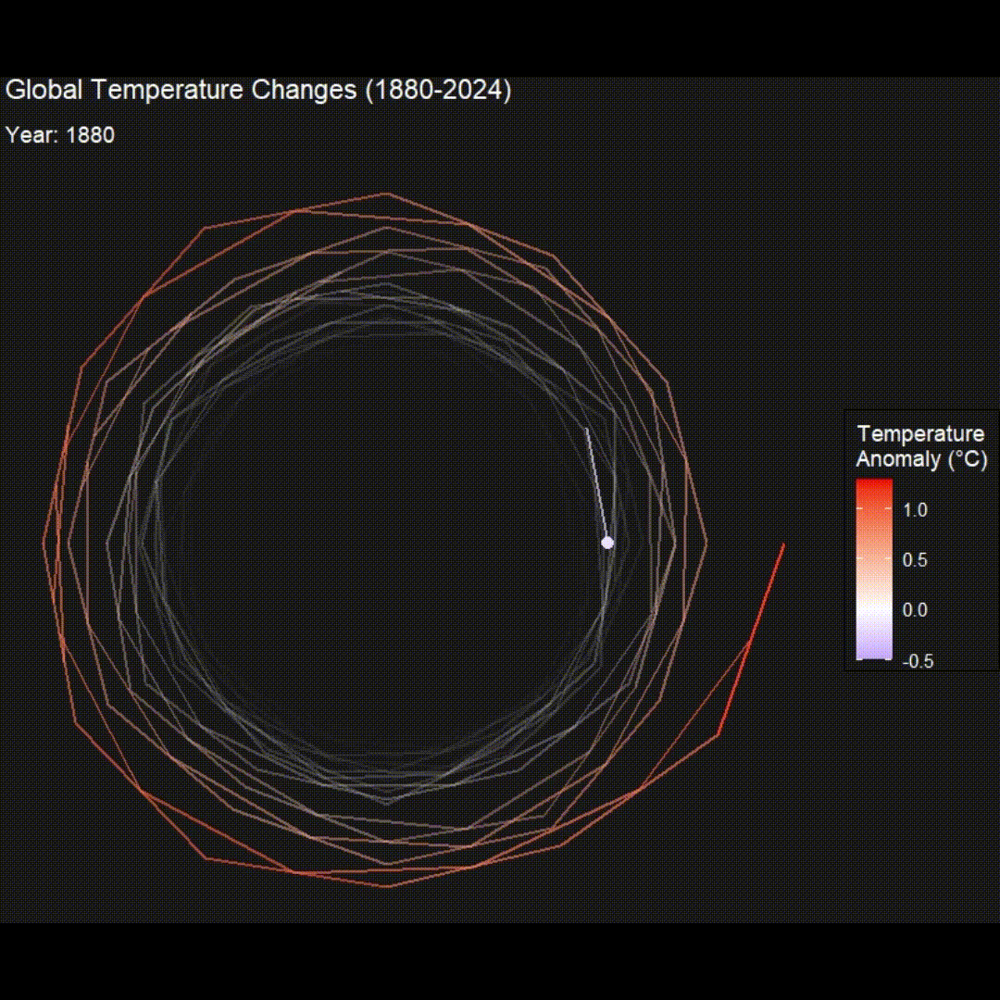

# Temperature Spiral Visualization

This project creates an interactive visualization of the change in global surface temperature data between 1880-2024 using R, showing the spiral pattern of global temperature increase over time.

## Animated Visualization

*MP4 to GIF conversion by [CloudConvert](https://cloudconvert.com/mp4-to-gif)*

## Interactive Visualization

[🌐 Open the interactive HTML visualization](temperature_spiral_interactive.html)

## Project Description

This visualization uses temperature data to create a spiral pattern that shows the progression of global temperatures over time. The interactive version allows users to explore the data in detail.

## Files in the Project

- `plot.R`: R script that generates the visualization
- `land_ocean_index.csv`: Temperature data source
- `temperature_spiral_interactive.html`: Interactive visualization
- `temperature_spiral.mp4`: Video version of the visualization
- `temperature_spiral.gif`: Animated GIF version

## How to Use

1. Clone this repository
2. Open `temperature_spiral_interactive.html` in a web browser to view the interactive visualization
3. Run `animated-spiral.R` in R to generate new visualizations

## Data Source

The temperature data comes from [NASA's land-ocean temperature index](https://climate.nasa.gov/vital-signs/global-temperature/?intent=121), providing a comprehensive view of global temperature changes. 